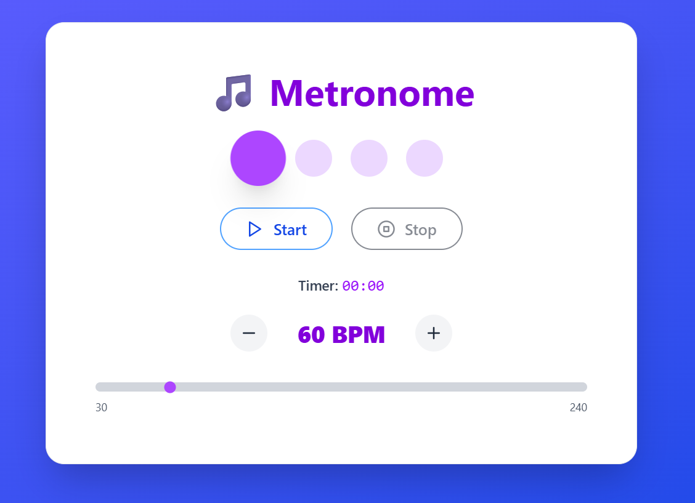

# 🎵 Metronome App



A modern, responsive metronome built with **React** and **TypeScript**. Designed for musicians and guitarists who need a reliable, customizable metronome on their PC. Featuring a clean UI, accurate timing, and sound feedback using the HTML5 Audio API.

---

## 🛠️ Tech Stack

- [React](https://reactjs.org/)
- TypeScript
- HTML5 Audio API
- Tailwind CSS

---

## 📸 Screenshot


---

## 📦 Installation

```bash
# Clone the repo
git clone https://github.com/Ritikchauhan1704/WebMetronome.git
cd WebMetronome

# Install dependencies
bun install

# Start development server
bun dev
```

---

## 🚀 Usage

- Adjust the BPM (beats per minute) using the slider or input box.
- Click the play/pause button to start or stop the metronome.
- Use the tap tempo feature to set BPM by tapping.
- Change time signature if available.
